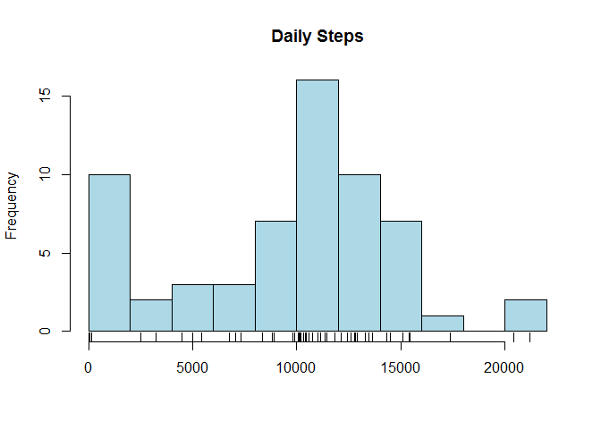
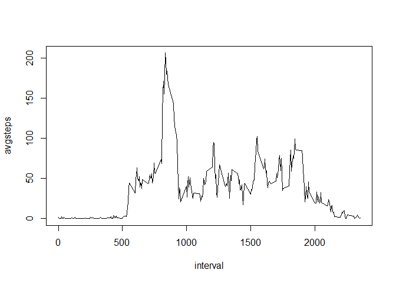
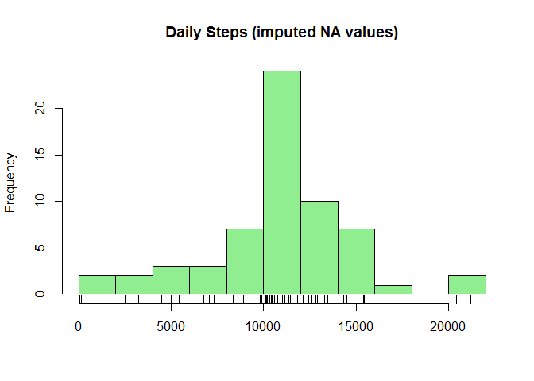

# Reproducible Research: Peer Assessment 1
Chris  
Saturday, December 19, 2015  


## Loading and preprocessing the data


```r
activity <- read.csv("activity.csv", stringsAsFactors = FALSE)
```


## What is mean total number of steps taken per day?


For this part of the assignment, you can ignore the missing values in the dataset.

1. Calculate the total number of steps taken per day


```r
library(dplyr)
activity_by_day <- tbl_df(activity) %>%
    group_by(date) %>%
    summarise(totalsteps = sum(steps, na.rm = T))
```


The total number of steps per day is now saved in the dataframe 'activity_by_day'.  
This is a lot to look at, so instead of displaying the data I will sumarize with a 
histogram, mean, and median.


2. If you do not understand the difference between a histogram and a barplot,
research the difference between them. Make a histogram of the total number of 
steps taken each day


```r
hist(activity_by_day$totalsteps, breaks = 10, 
     col = "light blue", 
     main = "Daily Steps", xlab = "")
rug(activity_by_day$totalsteps)
```

 


3. Calculate and report the mean and median of the total number of steps taken 
per day


```r
mean_steps <- prettyNum(mean(activity_by_day$totalsteps, na.rm = TRUE))
median_steps <- prettyNum(median(activity_by_day$totalsteps, na.rm = TRUE))
```


The mean number of steps per day is 9354.23.
The median number of steps per day is 10395.


## What is the average daily activity pattern?

1. Make a time series plot (i.e. type = "l") of the 5-minute interval (x-axis) and the average number of steps taken, averaged across all days (y-axis)


```r
activity_by_interval <- group_by(activity, interval) %>%
    summarise(avgsteps = mean(steps, na.rm = TRUE))
plot(activity_by_interval, type = "l")
```

 

2. Which 5-minute interval, on average across all the days in the dataset, contains the maximum number of steps?


```r
maxintervaldf <- filter(activity_by_interval, avgsteps == max(avgsteps))
maxinterval <- maxintervaldf$interval
maxsteps <- prettyNum(maxintervaldf$avgsteps)
```

The 5-minute interval with the highest average number of steps taken was the 
835 interval, with an average of 206.1698 steps taken.


## Imputing missing values

Note that there are a number of days/intervals where there are missing values
(coded as NA). The presence of missing days may introduce bias into some 
calculations or summaries of the data.

1. Calculate and report the total number of missing values in the dataset (i.e. 
the total number of rows with NAs)


```r
missingvalues <- sum(is.na(activity$steps))
```

In the original dataset there are 2304 missing or NA values.

2. Devise a strategy for filling in all of the missing values in the dataset. 
The strategy does not need to be sophisticated. For example, you could use the
mean/median for that day, or the mean for that 5-minute interval, etc.

My strategy is to replace the NA values with the mean for that 5-minute interval.

3. Create a new dataset that is equal to the original dataset but with the missing 
data filled in


```r
#I'll create a new data frame, activity_imputed, which includes a column 
#with the average steps for the interval
activity_imputed <- merge(activity, activity_by_interval,
                          by = "interval", all.x = TRUE)

#Then if the value is NA I'll replace that value with the average
activity_imputed$steps[is.na(activity_imputed$steps)] <- 
    activity_imputed$avgsteps[is.na(activity_imputed$steps)]
```


4. Make a histogram of the total number of steps taken each day and Calculate 
and report the mean and median total number of steps taken per day. Do these 
values differ from the estimates from the first part of the assignment? What is 
the impact of imputing missing data on the estimates of the total daily number of 
steps?


```r
#group the dataframe by date
activity_imputed_by_day <- group_by(activity_imputed, date) %>%
    summarise(totalsteps = sum(steps))
#calculate the mean number of steps taken per day on the adjusted data
mean_steps2 <- prettyNum(mean(activity_imputed_by_day$totalsteps))
#calculate the median number of steps taken per day
median_steps2 <- prettyNum(median(activity_imputed_by_day$totalsteps))
#make a histogram of total number of steps taken each day
hist(activity_imputed_by_day$totalsteps, breaks = 10,
     col = "light green", 
     main = "Daily Steps (imputed NA values)", xlab = "")
rug(activity_imputed_by_day$totalsteps)
```

 

The mean number of steps taken per day in the imputed data is 10766.19. 
After accounting for the NA values the mean is higher than the original reported 
mean value of 9354.23.

The median number of steps taken per day in the imputed data is 10766.19.
After accounting for the NA values the median is also slightly higher than the 
orginal reported median value of 10395.

It is somewhat surprising to me that the new mean value of 10766.19 is
equal to the new median value of 10766.19. Just an observation.


## Are there differences in activity patterns between weekdays and weekends?

For this part the weekdays() function may be of some help here. Use the dataset 
with the filled-in missing values for this part.

1. Create a new factor variable in the dataset with two levels - "weekday" and 
"weekend" indicating whether a given date is a weekday or weekend day.


```r
library(lubridate)
activity_imputed <- mutate(activity_imputed, realdate = ymd(date))
days <- weekdays(activity_imputed$realdate)
WD_WE <- ifelse(days %in% c("Saturday","Sunday"), "weekend", "weekday")
WD_WE <- as.factor(WD_WE)
activity_imputed$WD_WE <- WD_WE
```


2. Make a panel plot containing a time series plot (i.e. type = "l") of the 
5-minute interval (x-axis) and the average number of steps taken, averaged across 
all weekday days or weekend days (y-axis). See the README file in the GitHub 
repository to see an example of what this plot should look like using simulated 
data.


```r
activity_imputed_by_interval <- group_by(activity_imputed, interval, WD_WE) %>%
    summarise(avgsteps = mean(steps))
library(lattice)
xyplot(avgsteps ~ interval | WD_WE, 
       data = activity_imputed_by_interval, type = "l", 
       layout = c(1, 2))
```

 


